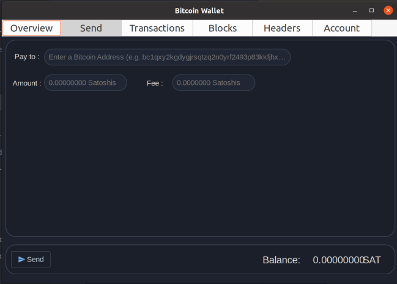

# 23C1-Rusteam-Fiuberico

<div align="center">
  <h1>BITCOIN NODE</h1>
  
</div>

## About the Project

The main goal of this project was to build a functional Bitcoin node following the [development guides](https://developer.bitcoin.org/devguide/index.html) and [protocol specifications](https://developer.bitcoin.org/reference/index.html).  
The project was developed using the [Rust](https://www.rust-lang.org/) programming language. For the graphical interface, we used [Gtk](https://www.gtk.org/) and the [Gtk-rs](https://gtk-rs.org/) module.

<div style="display: flex; justify-content: space-between;">
    
    
</div>

<div align="center">

## Node Functionalities

</div>

<p align="center">
  
</p>

* **Header and Block Download**: The node is capable of downloading and storing the entire blockchain header chain from the beginning and full blocks starting from the project start date (10/04/23).
* **Connection to Peer Nodes**: The node can retrieve IPs of active nodes through a configured DNS and connect to them, performing the `handshake` as defined by the Bitcoin protocol.
* **Reception of New Blocks**: The node can receive new blocks broadcast by other peers and store them in the local headers and blockchain.
* **Block Validation**: The node validates each incoming block using its `proof of work` and the `proof of inclusion` of the block's transactions. It builds the Merkle Tree from the transactions and compares the generated Merkle Root with the one declared in the block header.
* **UTXO Set Tracking**: The node maintains the `unspent transactions` list at all times to allow transaction creation.
* **Merkle Proof of Inclusion**: The node can generate a Merkle proof of inclusion for a given transaction and block, allowing the user to verify the transaction’s presence in the block.

<div align="center">

## Wallet Functionalities

</div>

<p align="center">
  
</p>

* **Multiple Account Support**: The user can add one or more accounts, specifying the public and private keys of each.
* **Account Balance Display**: Each account displays its respective balance.
* **Pending Transaction Notification**: When a pending transaction involving the user is received, they are notified immediately.
* **Confirmed Transaction Notification**: Upon receiving a confirmed block, the user is notified if any of their transactions are included, and these are marked as confirmed in the interface.
* **Transactions**: The user can initiate transactions from any account by entering the required data. P2PKH transactions are supported. The generated transaction is broadcast to other nodes for validation and inclusion in a block.
* **Inclusion Proof**: The user can request and verify a Merkle proof of inclusion for a transaction in a block.

### Configuration File

The `nodo.conf` file contains all the program’s configuration options. Editing this file allows changing the number of blocks/headers to download or persist, the network to connect to (mainnet or testnet), the peers to connect to, the number of connections, and many other options.

### Logs

Upon execution, a `logs` folder is automatically created. It contains detailed information about the program's flow and state:

- `info.txt`: General and useful information about the node's current state.
- `error.txt`: Describes the various errors encountered during execution.
- `messages.txt`: Contains all messages received from peers.

### Graphical Interface

The application includes a user-friendly GUI through which users can interact with the wallet. On launch, the blockchain download and synchronization progress is shown. The GUI includes the following views:

* **Overview**: Displays key information of the selected account: balance, address, and recent transactions.
* **Send**: Allows users to send transactions by filling in the required fields for the selected account.
* **Transactions**: Displays all past transactions for the selected account and allows Merkle proof requests.
* **Blocks**: Displays recently downloaded blocks and includes a search bar to find any block downloaded locally.
* **Headers**: Displays both the most recent and the earliest downloaded headers with search capability.
* **Account**: Shows the current account and allows new account entry.

## Requirements

* Install `Rust`: [https://www.rust-lang.org/tools/install](https://www.rust-lang.org/tools/install)
* Install `Gtk3`: [https://www.gtk.org/docs/installations/linux](https://www.gtk.org/docs/installations/linux)

## How to Use

To run the application with the graphical interface:

```sh
   cargo run nodo.conf
```
## References and Diagrams

* **Diagrams**: https://lucid.app/documents/view/24778bc5-a35d-4e87-a5ad-c2552bd2a0ec
* **Mid-Term Presentation**: https://www.canva.com/design/DAFjmdv7rnM/IeBxNe9kYaOrCZaoz6f55w/edit?utm_content=DAFjmdv7rnM&utm_campaign=designshare&utm_medium=link2&utm_source=sharebutton
* **Final Course Presentation**: https://www.canva.com/design/DAFm19ESnFU/V6mXLL9rlMYIW4rqmKbV5A/edit?utm_content=DAFm19ESnFU&utm_campaign=designshare&utm_medium=link2&utm_source=sharebutton
* 
### Detailed Report
You can read the full project documentation here:
https://docs.google.com/document/d/1p5l8UjiY5e11kFwzyFX7NvbX8w49kqBh/edit

## Team Members
- Facundo De La Plata
- Alan Cantero
- Martin Bucca

